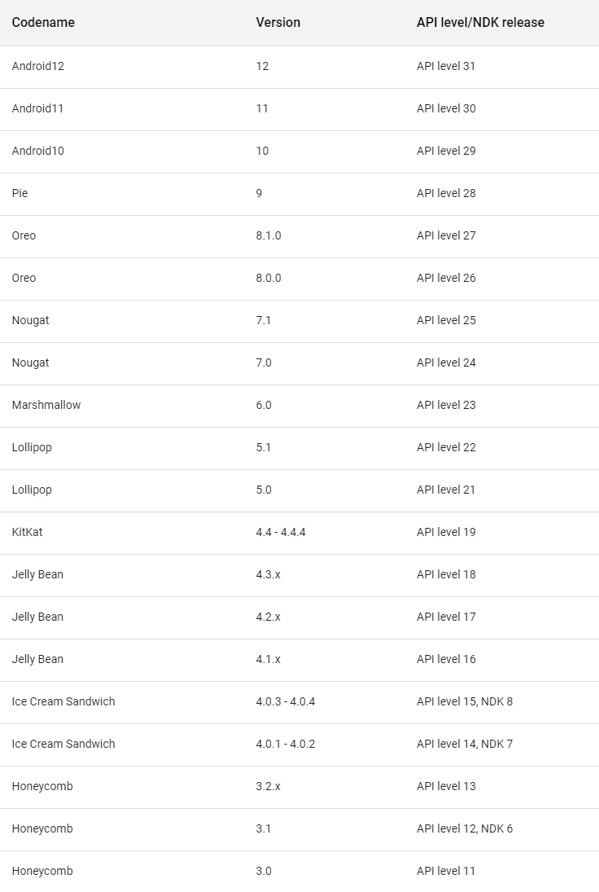
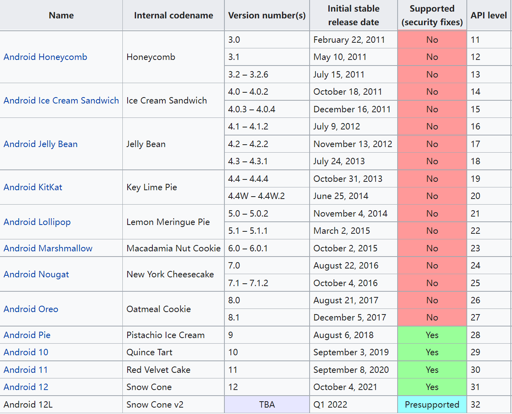
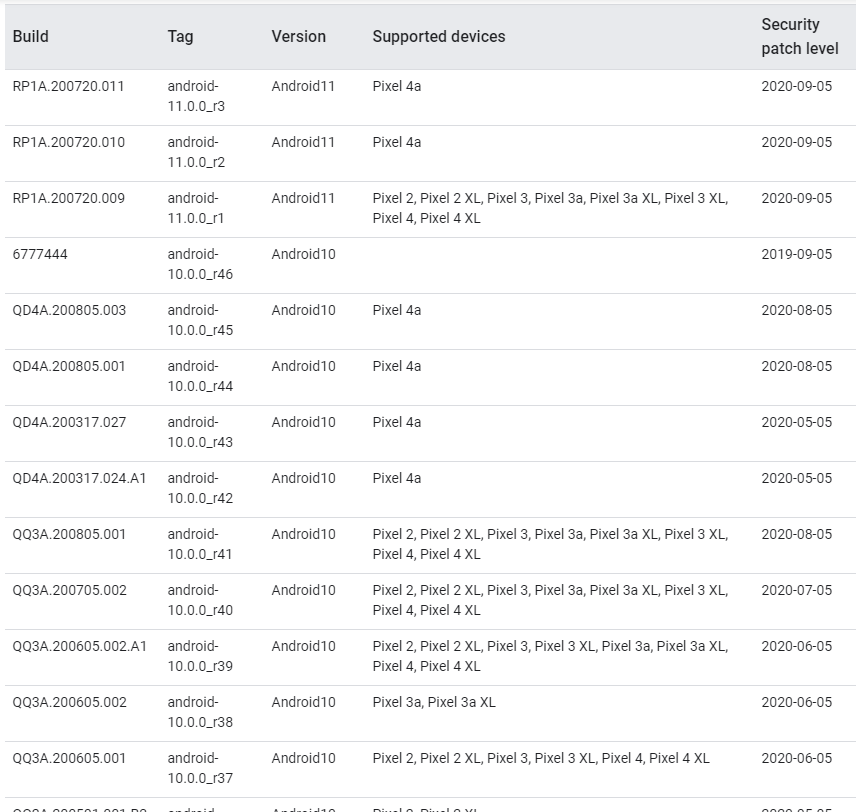

文章标题：**AOSP 的版本管理**

- 作者：汪辰
- 联系方式：<unicorn_wang@outlook.com> / <wangchen20@iscas.ac.cn>

文章大纲
<!-- TOC -->

- [1. 参考](#1-参考)
- [2. AOSP 的版本管理](#2-aosp-的版本管理)

<!-- /TOC -->

# 1. 参考

- [Android version history](https://en.wikipedia.org/wiki/Android_version_history)
- [Codenames, Tags, and Build Numbers](https://source.android.google.cn/setup/start/build-numbers)
- [What is API Level](https://developer.android.com/guide/topics/manifest/uses-sdk-element#ApiLevels)

# 2. AOSP 的版本管理

AOSP （Android Open Source Project），也就是我们常说的 Android（安卓），从 2005 开始到现在已经十五个年头，整个代码仓库已经变成了一个巨兽。那么这么多年来， Google 是如何管理这个项目的呢，特别是对海量代码的版本管理又是怎样的呢，今天整理了一下，希望能够说说清楚。

首先我们来看一张思维导图，后面的总结都将围绕这张图展开，大家看完后再回来回顾一下这张图，印象就更深了。

Android 的开发版本每一个大版本我们称之为一个 **Platform**。围绕 Platform 的概念，Google 提出了以下 **Version**、**Codename** 和 **API level** 三个和版本管理相关的概念：

- **Version**: 每个 **Platform** 有一个版本号 **Version**，这个 **Version** 的值是唯一的，我们就叫它 “版本号” 好了（后面直接用英文表达感觉更准确，其他关键字也是一样），可以作为关键字区分每个不同的 **Platform**。**Version** 的表达采用点分格式，完整的格式包括三段 `X.Y.Z`，但常常用不了那么多，所以经常简写为 `X` 或者 `X.Y`。 **Version** 的值是从 1.0 开始，依次递增，目前正式发布的已经达到 11。

- **Codename**: 同时针对不同的 **Platform**， Google 为了方便人记忆，又会赋予一个独立的 **Codename**，这些 **Codename** 的灵感源自美味的点心，譬如 Gingerbread/Honeycomb，就好比人的绰号。注意 **Codename** 和 **Version** 是一对多的概念，譬如同样叫 Oreo 对应的 **Version** 有 8.0.0 和 8.1.0。

- **API level**: 和 **Version** 对应的是 **API level**（有的 **Version** 还有对应的 **NDK release ID**，差不多是一个概念），所谓 API 就是每个 **Version** 的 Android Platform 的 framework 提供出来供上层的应用编程时调用的一套接口，所以 API 的版本（官方叫 level）是对应每一个 **Version** 都是唯一的。

有关 **Platform**、**Codename**、**Vesion** 和 **API level** 之间概念的历史信息，可以参考官网的总结表格如下 (由于图片较大，只截取了最新的一部分)，大家结合上面的总结再自己看一下：

(图片来源：https://source.android.google.cn/setup/start/build-numbers)

维基百科上有一幅图也不错，摘录如下(由于图片较大，只截取了最新的一部分)：

(图片来源：https://en.wikipedia.org/wiki/Android_version_history)

每个 **Platform** 开发和发布周期中的源码管理上还会衍生出更细的版本管理策略。这涉及两个概念：

- **tag**， 或者叫 “标签”，这个使用过 git 的同学应该是熟悉的，Google 在 AOSP 的代码树中会给不同版本的代码采用打 tag 的方式进行标记，tag 的格式是 `android-X.Y.Z_rN`，其中 X、Y、Z 和 N 是变量：
    - X.Y.Z 是上面介绍的 **Platform** 对应的 **Version**
    - N 是标识同一个 **Version** 下的二级小版本号，从 1 开始。

    tag 的一个例子：`android-10.0.0_r39`。

- **“构建（Build）”** 的概念。Android 开发团队针对某些 **tag** 标记的版本测试稳定后会发布比较正式的构建版本。针对这些构建版本会赋予一个唯一的 Build Number 进行标识。 从 Android 8.0.0 (Oreo) 开始以后的版本中，每个 **Build** 的命名格式为 `PVBB.YYMMDD.bbb[.Cn]`，其中：
    - P 表示平台版本代号的第一个字母，例如 O 表示 Oreo。
    - V 表示支持的行业。按照惯例，P 表示主要平台分支。
    - BB 是由字母和数字组成的代码，Google 可通过该代码识别 build 所属的确切代码分支。
    - YYMMDD 表示相应版本从开发分支细分出来或与开发分支同步的日期。它并不一定是具体构建的确切日期。
    - bbb 表示具有相同 YYMMDD 的不同版本，从 001 开始。
    - Cn 是可选的字母数字，表示基于 PVBB.YYMMDD.bbb 这个构建的一次小修补，从 A1 开始。

    **Build ID** 的一个例子：`QQ3A.200605.002.A1`，大家可以逐一对号入座。注意：早期 Android 版本采用另一种较短的 build ID 代码（例如 FRF85B），这里就不罗嗦了。

官网有关 **Build** 的总结表格如下，表格太长，我只是摘取了前面的部分条目：

(图片来源：https://source.android.google.cn/setup/start/build-numbers)

