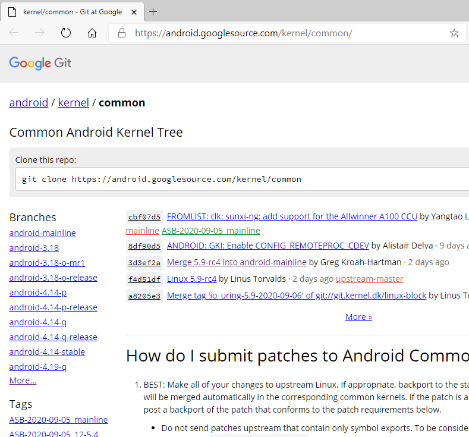

文章标题：**AOSP 内核的版本管理**

<!-- TOC -->

- [1. 参考](#1-参考)
- [2. 前言](#2-前言)
- [3. **Linux 内核** 的版本管理](#3-linux-内核-的版本管理)
- [4. **AOSP 内核** 的版本管理](#4-aosp-内核-的版本管理)
    - [4.1. AOSP 通用内核](#41-aosp-通用内核)
    - [4.2. Android Platform 的内核版本管理](#42-android-platform-的内核版本管理)
        - [4.2.1. “Launch Kenel”](#421-launch-kenel)
        - [4.2.2. “Feature Kernel”](#422-feature-kernel)
- [TBD](#tbd)

<!-- /TOC -->

# 1. 参考

- https://www.kernel.org/
- https://source.android.google.cn/devices/architecture/kernel

# 2. 前言

我们知道 AOSP（Android Open Source Project，和我们常说的 Android 是一个意思）所使用的操作系统内核就是 Linux。但 AOSP 使用的 Linux 内核是在原生 Linux 内核上加上了一些自己的东西，包括一些 Android 社区特有的特性（短期内还看不到可以被 Linux 接纳，以至于还未合并到 Linux upstream 的补丁程序）。所以严格地说 Android 的内核和 Linux 还不是一回事，本文中我们叫它 **AOSP 内核** 以示区别，而 Linux 则称之为 **Linux 内核**。

由于 **Linux 内核** 一直在演进， **Android 内核** 自身也在进化，所以如何尽可能用上 upstream Linux 内核的新特性，管理好 **Linux 内核** 与 **AOSP 内核** 之间的关系对于 Android 系统的发展来说一直是一件头等重要的事情。最近我整理了一下这方面的思路，总结在这里，供大家参考，有些地方也是加入了自己的一些理解，有什么说得不到位的地方，欢迎大家拍砖指正。

# 3. **Linux 内核** 的版本管理

首先熟悉一下 **Linux 内核** 的版本管理模式。

在版本发布管理模式上，**Linux 内核** 与标准的 AOSP 是很不相同的。从 2003 年 12 月往后，也就是 从 `2.6` 内核版本发布往后，内核开发者社区从之前维护单独的一个开发分支和另一个稳定分支的模型迁移到只维护一个 “稳定” 分支模型。在此模式下，每 2-3 个月就会发布一次新版本，出现这种变化的原因在于：`2.6` 版本内核之前的版本周期非常长（将近 3 年），且同时维护两个不同的代码库难度太高。

内核版本的编号从 `2.6.x` 开始，其中 x 是一个数字，会在每次发布新版本时递增（除了表示此版本比上一内核版本更新之外，该数字的值不具有任何意义）。内核版本发展到现在已经进入 5 系列（最新的是 `5.8.x`）。在众多内核版本中，分为 mainline 即主线版本，stable 稳定版本和 longterm 长期维护版本。其中 mainline 版本由 Linus 本人维护，每两到三个月会做一次升级，而且是两位数字版本号，不涉及第三位数字，譬如 `5.1`、`5.2`、`5.3` ......。stable 版本是针对 mainline 版本你的小版本更新，譬如对应 `5.1` 的会有 `5.1.1`、`5.1.2`、`5.1.3` ......。某一些 stable 版本会被指定为 longterm 版本（也称为 LTS），从而拥有更长的维护周期，直白了说就是其第三位数字会会变得很大。

下图是 Linux 的版本计划（by 2020/9）

(图片来源：https://www.kernel.org/)

下图是 Linux 的 LTS 版本计划（by 2020/9）

(图片来源：https://www.kernel.org/category/releases.html)

# 4. **AOSP 内核** 的版本管理

## 4.1. AOSP 通用内核

针对 Andorid 内核的管理， Google 定义了一个所谓 “AOSP 通用内核 ( AOSP common kernels，简称 ACKs)” 的概念。 ACKs 版本基于 **Linux 内核** 开发（术语上称之为 downstream，形象地说可以认为 **Linux 内核** 的发布处于上游，而 ACKs 随着 Linux 内核版本的升级而升级，就好像处在流水线的下游），ACKs 在 **Linux 内核** 的版本基础上包含了许多与 Android 社区相关但尚未合并到 LTS 的补丁程序，可以简单地分成以下几大类：

- Android 需要，存在于更新的 Linux mainline 版本上，但尚未合入当前 LTS 版本的内容。
- Android 需要，但未被 Linux mainline 接受的功能（例如 Energy Aware Scheduling/EAS）。
- Vendor（供应商）/ OEM（原始设备制造商）特有的功能（例如 sdcardfs）。

**AOSP common kernels** 的发布网站地址在 <https://android.googlesource.com/kernel/common/>。我截了个图，感兴趣大家可以看一下。

图上左侧 Branches 列表的第一个 `android-mainline` 是 Android 的主要开发分支。每当 Linus Torvalds 发布 Linux 的主线版本以及候选版本时，其 Linux 主线代码就会被合并到 `android-mainline` 中。

在 2019 年之前，**AOSP common kernels** 的构建方法是追踪最新的 LTS 内核版本，每次一个 Linux LTS 版本发布后， Google 就基于该最新的 LTS 版本添加特定于 Android 的补丁。但这么做的一个问题是 Linux LTS 版本发布的周期比较长（大概一年发布一次），由于跨度较大，每次基于 LTS 版本进行移植和添加 Android 的补丁冲突可能会比较大，容易引入混乱。所以从 2019 年开始 Google 修改了该流程，目前的做法是 `android-mainline` 持续保持对 Linux 的 mainline 版本的追踪，每次有正式发布，或者 RC 发布都同步升级这个 `android-mainline` 分支，基本思想就是将原来的一年一次升级分散到多个小步辐升级过程，再加上持续的每日构建和测试，避免了以前构建方式下执行 “前向移植（forward port）” 带来的压力。新的流程减轻了这些压力，保证了内核的高质量。当然代价是需要小心地维护 `android-mainline`，将维护的工作量分散到平时的工作中。

在以上持续更新 `android-mainline` 的基础上，当 Linux 宣布某个 mainline 版本成为一个新的 LTS 版本时，Google 将相对应地从 `android-mainline` 上拉一个新的对应该 LTS 的 **AOSP common kernel** 分支。因为 Google 和它的合作伙伴一直在积极维护这个 `android-mainline` 分支，所以在其基础上拉出来的分支代码都不会有太大的质量问题，这种迁移是无缝的。

此外，一旦某个 LTS 版本有小版本升级，我们仍然需要积极地将其修改合入对应的 **AOSP common kernels** 版本。例如，我们已经基于 Linux 的 `4.19` 建立了 **AOSP common kernels** 分支版本 `android-4.19-q`，当 Linux 对 `4.19.x` 进行更新，升级到 `4.19.y` 时，我们需要将对应的修改也相应合并到 `android-4.19-q` 中，从而保持 `android-4.19-q` 这个 **AOSP common kernel** 分支与最新的 `4.19.y` LTS Linux 内核版本同步同时又包含了特定于 Android 的补丁修改。

## 4.2. Android Platform 的内核版本管理

先回顾一下 AOSP 的层次模型。

(图片来源：AOSP 官网)

整个 AOSP 项目从层次上来看，最下面的是 **AOSP 内核**，其上部分除了 HAL 之外都可以认为是 AOSP 的 Platform 部分。这部分的代码，即 Android Platform 的 Version 版本发布由 Google 定义（有关 AOSP Platform 版本的相关介绍请参考我写的 [另一篇总结](./20200911-platform-version.md)）。结合 Google 自身的 Android Platform 的版本发布策略，Google 定义了与之相对应的最新的 Android 内核版本管理方法，总结在下面这张表格中。我们可以结合这张表继续深入理解一下 Google 对 Android 的内核版本的维护和管理思想。

(图片来源：https://source.android.com/devices/architecture/kernel/android-common#feature-and-launch-kernels)

这张表格的第一列是 **“Android platform release”**, 这个无需多言，基本上 Google 的策略是保持一年更新升级一个 Platform 的版本。过早的版本暂不予考虑。

### 4.2.1. “Launch Kenel”

这张表格的第二列叫 **“Launch Kenel”**。具体是什么意思呢，原来 Google 规定，每个 Android Platform 固定支持三个 **AOSP 内核** 版本用于发布（launching）新设备，这些 **AOSP 内核** 版本称之为 “Launch Kernel”。譬如，表格中 Android 11 支持的三个 **Launch Kernels** 版本分别是 `android-4.14-stable`、`android-4.19-stable` 和 `android11-5.4`。这些版本实际上就是上文我们介绍的从 `android-mainline` 分支上拉出来的对应各个 Linux LTS 版本的稳定分支。也就是说针对每个 Platform 发布，只支持最近的三个 Linux 内核 LTS 版本的稳定分支，而且这三个版本可以认为是每个 Platform 版本支持的 “老”、“中”、“青” 三代，还是以 Android 11 为例，其支持的 “老” 一代版本是 `android-4.14-stable`，恰好对应 Android 10 支持的 “中” 一代版本 `android-4.14-q`，以此类推。由于目前 Linux 的 LTS 分支差不多一年发布一个，而 Android 的 Platform 也是一年升级一个版本，所以对应每个 Android 的 Platform 版本支持的 LTS 内核版本也会吐故纳新，去掉一个最老的，加入一个新的，如此循环往复。Google 这么设计的考虑也是为了设备的兼容性和升级。假设有一款手机 Foo 采用 Android 10 platform，内核采用 `android-4.14-q`。当 Android 升级到 11 后，由于 Android 11 所支持的 “Launch Kernel” 中是宣称支持 `android-4.14-stable` 的，所以 Google 的兼容性测试会保证该手机即使不升级内核（更重要的是这也意味着不需要升级 Vendor/OEM 的驱动等），只升级 Platform 版本到 11 也是可以运行的，当然 11 中那些需要新内核补丁才可以工作的特性将无法工作，前提是该款手机不需要这些特定的新特性。

另外针对 **“Launch Kernel”**，我们会看到从 Android 11 开始，**“Launch Kernels”** 的命名发生了变化，其支持的三款 **“Launch Kernels”** 分别叫做 `android-4.14-stable`、`android-4.19-stable` 和 `android11-5.4`，其命名习惯发生了修改。

首先我们发现形如 `android-4.14-p` 这样的分支名称被替换为`android-4.14-stable`。`android-4.14-p` 这样的命名遵循的是 Codename 的缩写命名形式，其末尾的 `p` 其实就是 Pie 的首字母，所以这种命名方式也称为 “甜品（dessert）” 内核版本号。但考虑到从 10 开始对外 Google 不再使用甜品的绰号，所以先是采用 “stable” 代替了末尾的字母。

其次我们还看到形如 `android11-5.4` 这样的新规则。这种新的版本规则 Google 称之为 KMI kernel 分支。这和 Google 的新发明有关。所谓 KMI 全称叫 “Kernel Module Interface”，指的是 Linux 内核中提供给 “模块（Module）” 的编程接口 API。譬如 Vendor/OEM 会根据自己设备的特色为设备编写很多外设驱动模块，这些模块很可能并没有进入内核主线，或者在构建时和内核是独立编译安装的，那么维持模块和内核之间 API 的一致性就变得非常重要。如果 KMI 不一致很可能会导致系统升级时发生兼容性问题。为了解决 Android 版本的碎片化问题，从 Android 11 开始，Google 提出 **GKI（Generic Kernel Image）** 计划，这个具体可以参考 Andorid 官网有关 GKI 的说明：<https://source.android.google.cn/devices/architecture/kernel/generic-kernel-image>。简而言之就是通过统一内核的公共部分，并为内核模块提供稳定的内核模块接口（KMI），从而达到可以独立更新模块和内核的目的。与之对应的新的内核命令规则就叫 “KMI 内核”，具体形式为 `<androidRelease>-<kernel version>`，通过结合 Linux 内核版本号和 Android 的 Platform Version 号来唯一决定。譬如表格中的 `android11-5.4` 表达的意思就是基于 Linux 5.4 LTS 版本，并且是支持 Android Platform 11 及以上版本。

### 4.2.2. “Feature Kernel”

表格的第二列叫 **“Feature Kernel”**。我们知道，有时候为了支持 Android 的某个 Platform 的新的 “特性（Feature）”，可能会涉及到需要修改 Linux 内核（当然这种情况是比较少的，但也不能排除），那么添加了这些补丁的 AOSP 内核自然就叫 **“Feature Kernel”** 了。在 Android 11 之前我们看到基本上每个 “Launch Kernel” 都打上了 Platform 相关的补丁，所以针对每个 Platform 版本，三个 “Launch Kernel” 本身就是 “Feature Kernel”。这样的好处是延长了老设备的维护周期。还是以上面的 Foo 设备举例，其发布时采用内核版本 `android-4.14-q`，假设 Android Platform 从 10 升级到 11 后新增支持了一个特性 A，而且 A 这个特性是需要内核新增支持的，那么如果 Foo 这款手机也希望使用特性 A，那么它还是有内核可用的，当然除了升级内核到 `android-4.14-stable`，Platfrom 自然也需要升级到 11。但从 Google 的角度来看，Foo 生命周期的延长导致 4.14 内核系列的维护生命周期也变长了，这增加了碎片化的风险。所以从 Android 12（S）开始，为了控制和限制需要支持的稳定的 KMI 的个数，避免碎片化，Google 计划缩减每个 Platform 对应支持的 **“Feature Kernel”** 个数，从三个减为两个。从表格上来看，以 Android S 即 Platform version 为 12 的那行为例，“Feature Kernel” 不再支持 `android-4.19-stable`，后果就是如果 12 中引入了一个新特性 B，而且该特性需要内核补丁支持的话，已经发货的手机如果采用的是 `android-4.19-stable` 及以前的内核，那么必须强制升级内核到 `android12-5.4`，这也意味着 Vendor/OEM 维护的驱动等也需要相应适配到更新的 Linux 内核 5.4。

# TBD
补充 内核生命周期部分，
https://source.android.com/devices/architecture/kernel/android-common

> When entering the frozen phase, the branch is git-tagged with the KMI version string containing the KMI generation number. For example, when android11-5.4 was frozen, it was tagged with the KMI version string 5.4-android11-0 where the trailing 0 is the KMI generation number.
