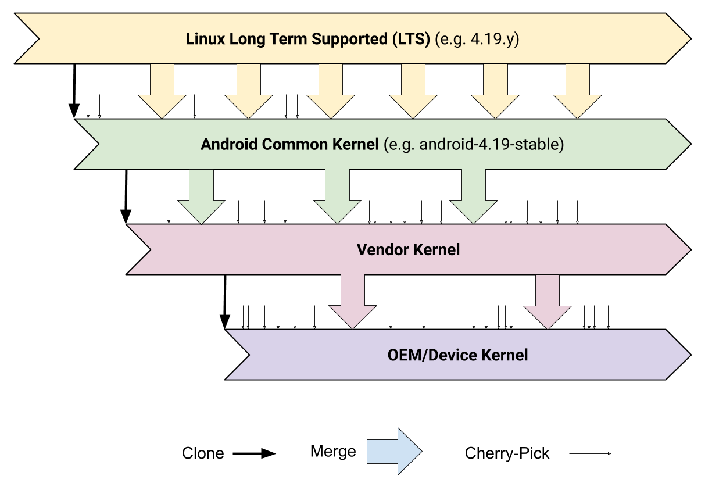
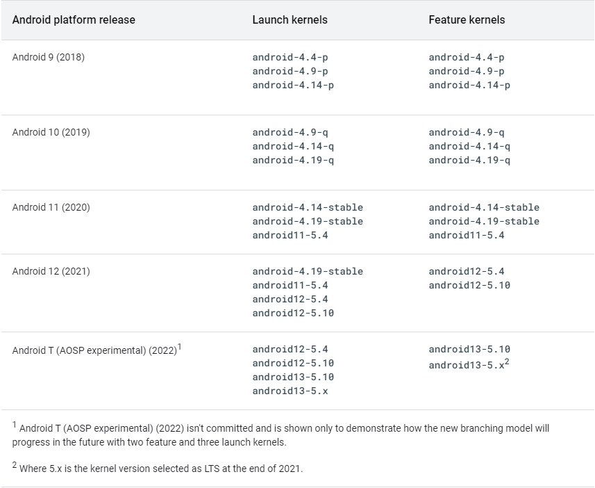
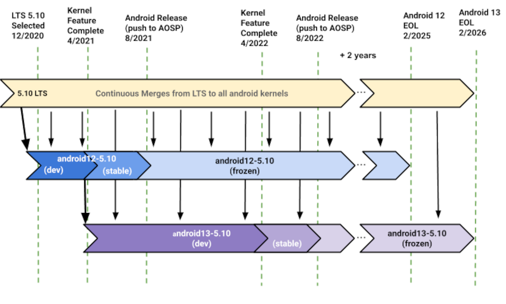

文章标题：**AOSP 内核的版本管理**

- 作者：汪辰
- 联系方式：<unicorn_wang@outlook.com> / <wangchen20@iscas.ac.cn>

文章大纲

<!-- TOC -->

- [1. 前言](#1-前言)
- [2. **Linux 内核** 的版本管理](#2-linux-内核-的版本管理)
- [3. **AOSP 内核** 的版本管理](#3-aosp-内核-的版本管理)
	- [3.1. AOSP Common Kernels](#31-aosp-common-kernels)
	- [3.2. ACK 的分支管理](#32-ack-的分支管理)
		- [3.2.1. Dessert kernel 分支](#321-dessert-kernel-分支)
		- [3.2.2. Release kernel 分支](#322-release-kernel-分支)
		- [3.2.3. KMI kernel 分支](#323-kmi-kernel-分支)
		- [3.2.4. ACK 分支的小结](#324-ack-分支的小结)
	- [3.3. “Launch Kenel” 和 “Feature Kernel”](#33-launch-kenel-和-feature-kernel)
		- [3.3.1. “Feature Kernel”](#331-feature-kernel)
		- [3.3.2. “Launch Kenel”](#332-launch-kenel)
	- [3.4. ACK KMI 分支的生命周期](#34-ack-kmi-分支的生命周期)

<!-- /TOC -->

# 1. 前言

我们知道 AOSP（Android Open Source Project，和我们常说的 Android 是一个意思）所使用的操作系统内核就是 Linux。但 AOSP 使用的 Linux 内核是在原生 Linux 内核上加上了一些自己的东西，包括一些 Android 社区特有的特性（短期内还看不到可以被 Linux 接纳，以至于还未合并到 Linux upstream 的补丁程序）。所以严格地说 Android 的内核和 Linux 还不是一回事，本文中我们叫它 **AOSP 内核** 以示区别，而 Linux 则称之为 **Linux 内核**。

由于 **Linux 内核** 一直在演进， **Android 内核** 自身也在进化，所以如何尽可能用上 upstream **Linux 内核** 的新特性，管理好 **Linux 内核** 与 **AOSP 内核** 之间的关系对于 Android 系统的发展来说一直是一件头等重要的事情。最近我整理了一下这方面的思路，总结在这里，供大家参考，有些地方也是加入了自己的一些理解，有什么说得不到位的地方，欢迎大家拍砖指正。

# 2. **Linux 内核** 的版本管理

首先回顾一下 **Linux 内核** 的版本管理模式。

在版本发布管理模式上，**Linux 内核** 有自己的一套。从 2003 年 12 月往后，也就是 从 `2.6` 内核版本发布往后，内核开发者社区从之前同时维护两个仓库（一个开发仓库和另一个稳定仓库）的模型转变为只维护一个仓库的模型（这个仓库由 Linus Torvalds 亲自维护，即 <https://git.kernel.org/pub/scm/linux/kernel/git/torvalds/linux.git/>，本文称之为 **Torvalds 发布仓库**）。该仓库每 2-3 个月就会发布一次新版本，这个版本我们也称之为 mainline 即主线版本，譬如 `5.7`、`5.8`，中间间隔的是大致每周一次的集成测试版本（Release Cadidate，简称 RC）版本。出现这种变化的原因在于：`2.6` 版本内核之前的版本周期非常长（将近 3 年），且同时维护两个不同的代码库难度太高。

但即使是 2 ~ 3 个月的发布周期，对于大多数用户来说还是太漫长了，中间可能发生很多的 bugfix 都不能及时发布到最终用户手中。于是社区又建了另一个仓库，称之为 **Stable 发布仓库**，即 <https://git.kernel.org/pub/scm/linux/kernel/git/stable/linux.git>。该仓库派生自 **Torvalds 发布仓库**，也就是说 **Torvalds 发布仓库** 上的改动都会进入 **Stable 发布仓库**，但该仓库同时又会针对某些两位内核版本继续打补丁，并保持每周都会有新的发布。**Stable 发布仓库** 发布的内核版本称之为 **stable 稳定版本**，其编号在 **Torvalds 发布仓库** 两段基础上增加为三段，譬如内核版本发展到现在已经进入 5 系列，**Torvalds 发布仓库** 的版本为 `5.x`，而 **Stable 发布仓库** 的版本号为 `5.x.y`）。**Stable 发布仓库** 由 Linus Torvalds 之外的专人负责。**Stable 发布仓库** 的开发周期一般会和 **Torvalds 发布仓库** 保持同步，举例来说就是一旦 **Torvalds 发布仓库** 发布了 `5.8`，则 **Stable 发布仓库** 中针对 `5.7.y` 的开发就宣告结束并进入下一个新的 `5.8.y` 的周期。

但在实践中人们又发现，上面的管理方式还有缺陷，就是很多 Linux 用户（譬如一些发行版）从稳定性出发，不想过快地引入新的特性，从而希望社区对某些特定的 stable 内核版本的支持时间能更长一些。为此，社区又创建了长期支持（Long Term Supported，简称 LTS）内核版本，并于 2006 年发布了第一个 LTS 内核（2.6.16）。从那时起，每年都会选择一个新的 LTS 内核，内核社区会维护该内核至少 2 年。本质上讲，LTS 版本仍然是 Stable 版本，它和普通的 Stable 版本唯一的区别就是其第三位数字会变得很大。

除了上面谈到的两个仓库外，还有一个用于存放那些希望在下一个 merge 窗口被合入 mainline 的补丁代码的仓库，官方原始仓库位置在：<https://git.kernel.org/pub/scm/linux/kernel/git/next/linux-next.git>。我们姑且称之为 **Next 仓库**。Linus 一般会在某个正式版本（譬如 v5.4）发布的同时就会为下一个版本（譬如 v5.5）开启一个 merge windows，所谓的窗口期你可以理解成一段时间，大概在两周左右，在此期间，**Torvalds 发布仓库** 的 master 分支会从 **Next 仓库** 以及各个子模块的维护者处接收 patch 并合入 master，当合入一些 patch 后，就会形成下一个版本的候选版本（这里是 v5.5-rc1），然后一般会经历多个 RC 版本，等待时机成熟后就会正式发布下一个版本的 Mainline 内核（这里是 v5.5）。所以说 **Next 仓库** 已经成为内核开发过程中不可或缺的一部分；也就是说，如果你希望你的补丁进入 mainline 内核，特别是进入下一个主线版本，那你就得在相应的合并窗口打开之前的一段时间争取将你的补丁被接纳进入 **Next 仓库**，当然这要取决于你的能力外加一点点运气 ;)。

总结一下：**Linux 内核** 通过三个仓库，三种类型版本实现对 Linux 的版本管理。

- 两个仓库：
  - **Torvalds 发布仓库**：<https://git.kernel.org/pub/scm/linux/kernel/git/torvalds/linux.git/>
  - **Stable 发布仓库**：<https://git.kernel.org/pub/scm/linux/kernel/git/stable/linux.git>
  - **Next 仓库**：<https://git.kernel.org/pub/scm/linux/kernel/git/next/linux-next.git>

- 三种版本：
  - **mainline 版本**
  - **Stable 版本**
  - **LTS 版本**

可以看一些 Linux 官网的版本发布计划表对照理解一下。

下图是 Linux 的版本计划（by 2020/9）

**【图 1】** (图片来源：https://www.kernel.org/)

下图是 Linux 的 LTS 版本计划（by 2020/9）

**【图 2】** (图片来源：https://www.kernel.org/category/releases.html)

# 3. **AOSP 内核** 的版本管理

## 3.1. AOSP Common Kernels

在 Android 的世界里，设备上运行的 Linux 内核分为以下四类：

- **Linux mainline**，即我们上面一章中提到的由 Torvalds 发布的 upstream 版本。
- **AOSP 内核**，这是 Google 自己管理的 Linux 内核，也是我们这里要重点讨论的 “AOSP 通用内核 ( AOSP Common Kernels)”，简称 **ACK**。 ACKs 的版本基于 **Linux mainline** 开发（术语上称之为 downstream，形象地说可以认为 **Linux mainline** 的发布处于上游，而 **ACK** 随着 Linux 内核版本的升级而升级，就好像处在流水线的下游），**ACK** 在 **Linux mainline** 的版本基础上包含了许多与 Android 社区相关但尚未合并到 LTS 的补丁程序，可以简单地分成以下几大类：
  - Android 需要，存在于更新的 Linux mainline 版本上，但尚未合入当前 LTS 版本的内容。
  - Android 需要，但未被 Linux mainline 接受的功能（例如 Energy Aware Scheduling/EAS）。
  - Vendor（供应商）/ OEM（原始设备制造商）特有的功能（例如 sdcardfs）。
- **Vendor 内核**：主要指的是 SoC 供应商提供的内核，从 **ACK** 派生而来，并针对 SoC 做了特定优化，包含了一些支持该 SoC 的外围设备驱动程序等。典型的 Vendor 包括像高通，MTK 等。
- **OEM 内核**：由原始设备制造商 (OEM) 提供的内核，从 Vendor 内核派生而来，添加了其他外围设备的启动程序，以及对系统的一些自定义配置改动。典型的 OEM 包括采用高通/MTK 芯片的手机设备制造厂家，这里就不列名单了。

整个生态链可以如下图所示：

**【图 3】** （图片来源：[The Generic Kernel Image (GKI) project][4]）

**ACK** 的发布网站地址在 <https://android.googlesource.com/kernel/common/>。
我截了个图，感兴趣大家可以看一下。

**【图 4】** ACK 官方仓库

## 3.2. ACK 的分支管理

**【图 4】** 左侧 Branches 列表包含了很多分支，具体这些分支的分类比较复杂，感兴趣的请参考 [Android Common Kernels][3] 上对各类分支的介绍，我这里试图从历史发展的角度谈一下这些分支都是怎么来的。 

本章节描述主要参考下面这张 **【图 5】**。

**【图 5】** ACK 的分支模型（图片来源：[Android Common Kernels][3]）

### 3.2.1. Dessert kernel 分支

这些分支对应比较早的 **ACK**。这些分支的命名上带有 Android 传统的 Dessert （甜点）的代号缩写字母。当时（我猜测是在 2019 年之前）在当一个 AOSP 平台版本发布之前，Google Android 内核团队会从上游 Linux 仓库中 clone 一个最新的 LTS 版本然后在这个版本上添加上 Android 自己的补丁。在 AOSP 版本开发期间，这个 **ACK** 会持续跟踪对应上游 LTS 版本的更新，将补丁 pick 进来，但保证不会添加新的特性。譬如 Android Q 对应有一个 Dessert kernel 分支是 `android-4.9-q`，这个分支会追踪上游的 `4.9.y` 分支。

由于从 Android 10 开始，Android 平台版本不再采用传统的 Dessert 命名方案，因此对于开发团队内部来说 Q 是最后一个甜点版本，所以我们看到有类似 `android-4.14-q` 这样的分支，但是不会再有 `android-4.14-r` 这样的分支，所以我们看到本该出现的譬如 `android-4.14-r` 或者 `android-4.19-r` 被替换为 `android-4.14-stable` 和 `android-4.19-stable`。

### 3.2.2. Release kernel 分支

命名为形如 `android-4.9-q-release`/`android-4.14-q-release`/`android-4.19-q-release` 这样的分支，应该是针对 Dessert kernel 的 release 版本分支。但由于该类分支在 Android 11 之后将不再维护，所以我这里就不啰嗦了。

### 3.2.3. KMI kernel 分支

传统的 Dessert kernel 分支的处理方式存在一个问题：Linux LTS 版本发布的周期比较长（大概一年发布一次），由于跨度较大，每次基于 LTS 版本进行移植和添加 Android 的补丁冲突可能会比较大，容易引入混乱。所以从 2019 年开始 Google 修改了该流程。目前的做法是维护一个叫做 `android-mainline` 的分支，持续保持对 **Linux mainline** 的追踪，每次 Linus Torvalds 有正式发布，或者 RC 发布都同步升级这个 `android-mainline` 分支，基本思想就是将原来的一年一次升级分散到多个小步辐升级过程，再加上持续的每日构建和测试，避免了以前构建方式下执行 “前向移植（forward port）” 带来的压力。新的流程减轻了这些压力，保证了内核的高质量。当然代价是需要小心地维护 `android-mainline`，将维护的工作量分散到平时的工作中。

在以上持续更新 `android-mainline` 的基础上，当 Linux 宣布某个 mainline 版本成为一个新的 LTS 版本时，Google 将相对应地从 `android-mainline` 上拉出一个新的对应该 LTS 的 **ACK** 分支。因为 Google 和它的合作伙伴一直在积极维护这个 `android-mainline` 分支，所以在其基础上拉出来的分支代码都不会有太大的质量问题，这种迁移是无缝的。

这个改变是从 2019 年开始的，2019 年开始的 LTS 是 5.4，所以从 2019 年开始 Google 新建的 **ACK** 的分支就变成了：`android11-5.4`、`android12-5.4`、`android12-5.10`、...... 这些较新的 **ACK**（5.4 及更高版本）也称为 GKI （Generic Kernel Image）内核。GKI 内核具有稳定的内核模块接口（Kernel Module Interface，简称 KMI），KMI 指的是 Linux 内核中提供给 “模块（Module）” 的编程接口 API。譬如 Vendor/OEM 会根据自己设备的特色为设备编写很多外设驱动模块，这些模块很可能并没有进入内核主线，或者在构建时和内核是独立编译安装的，那么维持模块和内核之间 API 的一致性就变得非常重要。如果 KMI 不一致很可能会导致系统升级时发生兼容性问题。为了解决 Android 版本的碎片化问题，从 Android 11 开始，Google 提出 **GKI（Generic Kernel Image）** 计划，这个具体可以参考 [Andorid 官网有关 GKI 的说明][4]。简而言之就是通过统一内核的公共部分，并为内核模块提供稳定的内核模块接口（KMI），从而达到可以独立更新模块和内核的目的。与之对应的新的内核命令规则就叫 “KMI 内核”。KMI 内核对应分支的具体命名形式为 `<androidRelease>-<kernel version>`，通过结合 Linux 内核版本号和 Android 的 Platform Version 号来唯一决定了 KMI 的版本号。譬如表格中的 `android11-5.4` 表达的意思就是基于 Linux 5.4 LTS 版本，并且是支持 Android Platform 11（这个版本也可以支持 12 的手机，但只能确保手机启动，并不能保证手机全功能可用。具体原因见下面的 “Launch Kenel” 和 “Feature Kernel” 相关章节）。

### 3.2.4. ACK 分支的小结

- Google 把自己管理的 Android 的 Linux 内核都叫做 ACK
- **ACK** 有一个统一的代码仓库，**Linux mainline** 是其 upstream
- **ACK** 分支分两大类：
  - Dessert kernel 分支，早期的，5.4（不含）之前的，不是从 `android-mainline` 上派生。形如：`android-4.9-q` 或者 `android-4.9-q-release`。
  - KMI kernel 分支，新的，5.4（含）之后的，统一从 `android-mainline` 上派生。 具体命名形式为 `<androidRelease>-<kernel version>`，譬如 `android11-5.4`

## 3.3. “Launch Kenel” 和 “Feature Kernel”

在理解了 **ACK** 以及 **ACK** 的分支管理相关概念后，我们来看一下，Google 对 Android 内核版本的管理，是如何与 Android Platform 的版本发布策略结合的，总结在下面这张表格中。我们可以结合这张表继续深入理解一下 Google 对 Android 的内核版本的维护和管理思想。

**【图 6】**  (图片来源：早期的 [Android Common Kernels][3]，已不是最新的，保留在这里是因为我个人还比较关心 4.4, 另外注明一下，截止 2022 年 android 13 发布，x 定义为 15 )

这张表格的第一列是 **“Android platform release”**, 这个无需多言，基本上 Google 的策略是保持一年更新升级一个 Platform 的版本。过早的版本暂不予考虑。

### 3.3.1. “Feature Kernel”

表格的第三列叫 **“Feature Kernel”**，这个概念比较好理解，每个版本的 Platform 都有自己匹配的 **“Feature Kernel”**。这个意思是说：为了支持 Android 的某个 Platform 的新的 “特性（Feature）”，可能会涉及到需要 Linux 内核 新特性的支持（当然这种情况是比较少的，但也不能排除）。譬如：完全满足 Andorid 12 特性的 **“Feature Kernel”** 包括 `android12-5.4` 和 `android12-5.10`。从 Android 12（S）开始，为了控制和限制需要支持的稳定的 KMI 的个数，避免碎片化，Google 计划缩减每个 Platform 对应支持的 **“Feature Kernel”** 个数，从三个减为两个。

Android 内核的命令规范从 12 开始才感觉比较规范（或者说符合现在最新的 Google 的想法）。举例来说，看到 `android12-5.4` 那说明使用这个版本的内核，搭配 Android 12 可以启用所有的 12 的特性。已经发货的手机如果安装的是 `android-4.19-stable` 及以前的内核，那么如果要升级 system 为 Android 12 并确保 12 工作完全正常（而不仅仅是可以开机启动），则必须强制升级内核到 `android12-5.4` 或者 `android12-5.10`，这也意味着 Vendor/OEM 维护的驱动等也需要相应适配到更新的 Linux 内核。

### 3.3.2. “Launch Kenel”

这张表格的第二列叫 **“Launch Kenel”**。具体是什么意思呢，原来 Google 规定，每个 Android Platform 固定支持至少三个 **AOSP 内核** 版本用于启动（launching）新设备。注意所谓 Launching 仅保证设备可以至少启动运行该 Platform 版本，但不保证可以确保该 Platform 能够 Full feature enabled。举个例子，假设一台手机原来发布的时候 Platform 版本是 Android 11，对应的内核是 `android11-5.4`。那么我们知道此时 Android 11 是 Full feature enabled 的，因为根据【图 6】中 Android 11（2020）对应的那行我们知道，`android11-5.4` 是其对应的 **“Feature Kernel”**。假设到了 2021 年 Android 12 发布了，我们对这款手机单独更新了 Platform 版本，通过刷写 system 分区但没有更新内核所在的 boot 分区，那么我们是否可以开机呢？查看【图 6】中 Android 12（2021）那行我么你知道，`android11-5.4` 是其对应的 **“Launch Kenel”** 版本，那么开机没问题，但是我们是否可以认为 Android 12 在这台手机上是 Full feature enabled 的呢？那么我们继续看【图 6】中 Android 12（2021）那行的第三列，因为 `android11-5.4` 不是 Android 12 对应的 **“Feature Kernel”**，所以 Google 或者OEM 厂家不能保证你的手机可以完全享用 Android 12 带来的一些新功能。

对于 **“Launch Kernel”**。从表上可以看出来，针对每个 Platform 发布，只支持最近的三到四个 **ACK**，而且这几个版本可以认为是每个 Platform 版本支持的 “老”、“中”、“青” 三代，以 Android 12 为例，其支持的 “老” 一代版本是 `android-4.19-stable`，恰好对应 Android 11 支持的 “中” 一代版本 `android-4.19-stable`，以此类推。由于目前 Linux 的 LTS 分支差不多一年发布一个，而 Android 的 Platform 也是一年升级一个版本，所以对应每个 Android 的 Platform 版本支持的 **ACK** 内核版本也会吐故纳新，去掉一个最老的，加入一个新的，如此循环往复。Google 这么设计的考虑也是考虑到移动设备作为消费品的生命周期以及为了设备的兼容性和升级。

## 3.4. ACK KMI 分支的生命周期

我们目前以及将来接触的新的 ACK 将以 **KMI 内核分支** 为主，**Dessert 内核分支** 将逐渐淡出，所以我们重点来看看 KMI 内核分支的生命周期，了解一下 Google 这边是如何处理一个 **ACK** 内核分支的。

**【图 6】**  (图片来源：[Android Common Kernels][3])

与 Linux 所维护的分支相类似，一个完整的 ACK 内核分支的开发周期也经历 “开发-稳定-冻结” 三个阶段。

- 开发（Development）阶段：当一个新的 Android Platform 开发启动之初，会选择一个最新的上游内核 LTS 的版本，譬如图中 AOSP 12 启动时对应的最新的上游 Linux LTS 内核是 v5.10，此时我们就有了一个 ACK KMI 内核分支 `android12-5.10`。因为此时处于开发阶段，Feature 的添加是开放的，不受限制。在当前 Platform （12）开发期间，可能会提前开始下一个 Platform （13）的开发，v5.10 将会是跨 12 和 13 的 **Feature Kernel**，所以我们会新建一个 `android13-5.10` 的 ACK KMI 内核分支。
- 稳定（Stabilization）阶段：当一个 ACK 内核版本的 Feature 开发结束后，其进入了稳定阶段。在这个阶段中，尽管可以接受某些针对 Vendor 的特殊功能与 bug 修复的改动，但是对 KMI 的修改会非常小心（尽管此时还允许修改 KMI）。
- 冻结（Frozen）阶段：这里的冻结指的是针对 KMI 的冻结，除非非常严重的安全问题，否则一旦进入冻结阶段，内核将只允许 bugfix，对 KMI 的修改是禁止的从而保证 KMI 的稳定性。参考 [Android Common Kernels][3] 中提到的进入冻结阶段后的 tag 命名问题，我查了一下 ACK 代码库，似乎命名规则有变化（不是数字而是日期形式），这个还要继续看看。

[1]:https://source.android.google.cn/devices/architecture/kernel
[2]:https://source.android.google.cn/devices/architecture/kernel/releases
[3]:https://source.android.google.cn/devices/architecture/kernel/android-common
[4]:https://source.android.com/devices/architecture/kernel/generic-kernel-image
[5]:https://tinylab.org/linux-repo-intro/

