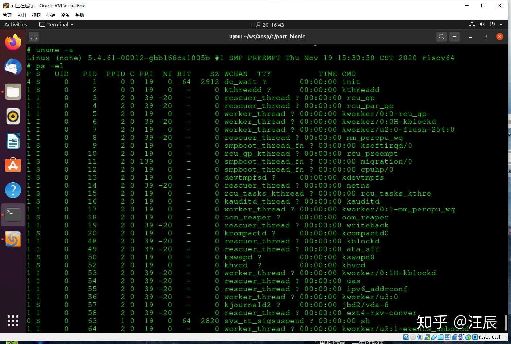
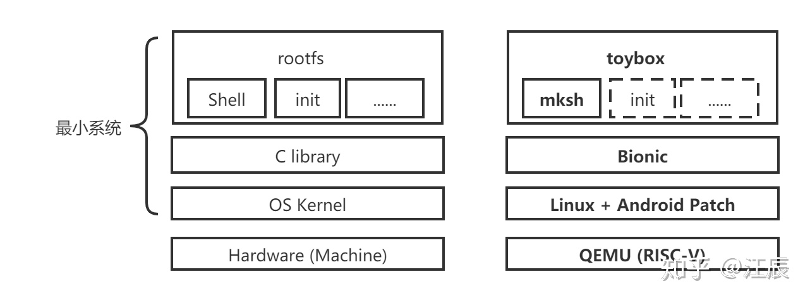
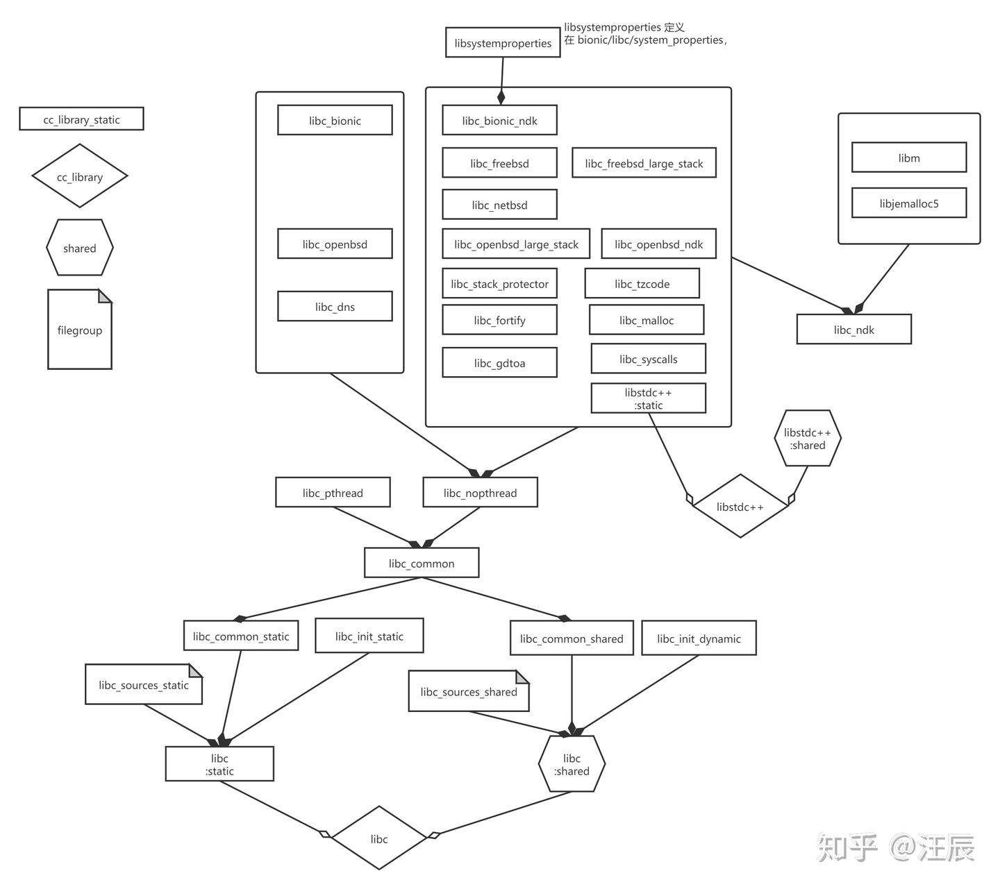
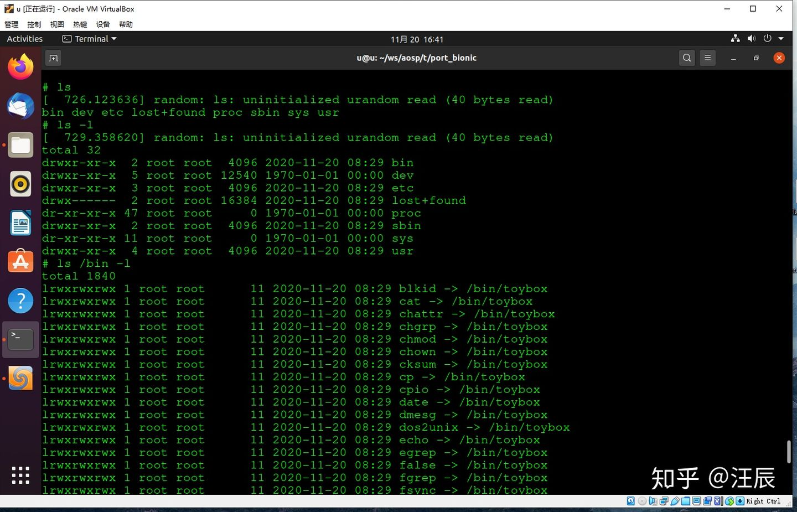

文章标题：**第一个 RISC-V 上的“Android 最小系统”**

- 作者：汪辰
- 联系方式：<unicorn_wang@outlook.com> / <wangchen20@iscas.ac.cn>

文章大纲

<!-- TOC -->

- [1. 需求分析](#1-需求分析)
- [2. 移植工作介绍](#2-移植工作介绍)
- [3. 实验步骤](#3-实验步骤)
	- [3.1. 构建 GNU 工具链](#31-构建-gnu-工具链)
	- [3.2. 构建 LLVM/Clang 工具链](#32-构建-llvmclang-工具链)
	- [3.3. 构建 QEMU](#33-构建-qemu)
	- [3.4. 构建 Android 内核](#34-构建-android-内核)
	- [3.5. 构建 “最小系统”](#35-构建-最小系统)
	- [3.6. 运行](#36-运行)

<!-- /TOC -->

经过这段时间以来的埋头苦干，目前我们已经可以在 RISC-V 的 QEMU 上启动一个 Android 的 “最小系统”。先来张图，有照为证。



下面简单总结一下这段时间的工作，虽然前方征途依旧漫长，但好歹有了一点可以看到的东西。

# 1. 需求分析

我们的项目全称是 AOSP for RISC-V，目前所有源码开源在 github 上：<https://github.com/aosp-riscv> （注：与本文工作对应的代码仓库已经备份到 <https://gitee.com/aosp-riscv-bionic-porting>，具体参考 [项目 README 文件][1] 中 2021-01-xx 的日志记录）。说白了就是希望乘着 RISC-V 这阵春风将 Android 也移植到 RISC-V 上去。当然这个终极目标很大。

但目前我们还有一个小目标，用一句话描述就是：`基于 RISC-V 平台，实现在 QEMU 上跑起来 Android 的 kernel 部分，并将 Android 的 Shell 运行起来。`

基于以上目标，具体分析来说，也就是要实现一个最小的 Android 系统，这里的 **“最小系统”** 的含义就是所谓的 “bootable unix-style command line operating system”。传统意义上一个完整的 “最小系统” 如下图的左侧所描述，从下往上，最下面是硬件（注意：硬件不算我们的 “最小系统” 的一部分）。硬件上运行的第一层软件是操作系统内核 (Operating System Kernel)，OS kernel 上是 [C 库 (C Library)][2]，基于 C Library 我们就可以搭建一个最小的文件系统，一个可以满足我们基本操作的文件系统本质上来说就是一堆命令行工具，这些命令行工具里至少要包含一个 init， 用于配合内核启动基本的登录 Shell，以及一个 Shell 用于和用户交互，用来调用其他的工具程序。有了这个 **“最小系统”**，我们的大目标就有了一个基础。



通过对 AOSP 的调研，我大致归纳了我们需要实现的工作如下：

- 硬件部分：这里我们先采用 QEMU for RISC-V 来模拟。
- OS Kernel：Android 的内核采用的就是 Linux，当然打上了自己的一些补丁。有关如何在 RISC-V 的 QEMU 上运行一个 Android 的内核，我们在另外一篇文章 [《编译一个 RISC-V 的 Android 内核》][3] 中有过介绍
- C Library：Android 有自己的 C 库，就是 bionic。它与 GNU C库（glibc）的不同之处在于，它是为内存和处理器能力较低的并且运行 Linux 的设备设计的。它基于 BSD 许可发布，而不是像 glibc 那样使用 GNU 公共许可证。
- Rootfs：Android 有自己复杂的文件系统组织，作为我们实验的目标，我们需要的是一个最精简的最小文件系统，暂时没有必要将 Android 的完整系统移植过来，所以我选择了 [toybox][4] 来实现我们的各种命令行工具。同学们可能会问为啥不用更著名的 [busybox][5]，原因还是和软件许可证有关，busybox 是 GPL，而 toybox 是 BSD，自然更符合 Android 的胃口，所以最后被包含在 AOSP 的源码树里的就是 toybox，而不是 busybox。另外需要提一下，由于 toybox 实现得十分简陋，我基于的 AOSP 版本中 toybox 自带的 shell 还无法正常工作，好在 Android 已经有了自己官方的 Shell，就是 [mksh][6]，所以对于 Shell 我们就直接用 mksh。

# 2. 移植工作介绍

上面谈了整体移植工作需要做哪些内容。在具体的实现上其实还有很多的细节，由于我们的最终目标（将 AOSP 整体移植到 RISC-V 上）还远未实现，所以我先就我目前已经实现的内容简单梳理了一下，作为阶段总结记录在这里备忘：

- 运行平台（硬件）：目前暂时采用 QEMU
- AOSP 版本：基于 `android-10.0.0_r39` 的 tag
- 编译环境：AOSP 的编译已经完整迁移到 LLVM/CLANG，但在链接部分仍然使用的是 GNU tools。由于 AOSP 自带的 Prebuild 工具链不支持 RISC-V，所以我采用自己制作的 LLVM/Clang 和 GNU-tools。有关 LLVM/Clang，可以参考我的另一篇文章 [《制作一个针对 RISC-V 的 LLVM/Clang 编译器》][7]；有关 GNU-tools 的制作，参考另一篇文章 [《在 QEMU 上运行 RISC-V 64 位版本的 Linux》][8]。
- 内核的移植，参考我的另一篇文章 [《编译一个 RISC-V 的 Android 内核》][3]，我采用的内核版本是 common 仓库的 `android-5.4-stable` 加上 configs 仓库的 `android11-release`。
- BIONIC 库的移植，如前所述，基于 `android-10.0.0_r39` 的 tag，考虑到第一期的需求，只实现 libc 的静态库，未实现 libc 的动态库以及 libm/libdl/libstdc++/linker。也就是说下面的 toybox 和 mksh 这些可执行程序都是静态链接的。libc 是 bionic 的最主要部分，组成内容相当庞杂，其中的主要组件以及组件之间的依赖关系简单总结如下图：

  

- toybox：如前所述，基于 `android-10.0.0_r39` 的 tag，但做了相当多的裁剪。因为 Android 中的 toybox 引入了许多 Android 特有的特性，比如 SELinux 和加密等等，为了不牵扯太多的精力，我在移植时 disable 这些功能，只保留了基本的一些常用功能。
- mksh：Shell 部分看上去比较单纯，所以直接拿来，只要确保编译没有问题即可。
- 整个移植过程中还有一块很大的工作是涉及构建系统的搭建。我没有使用 AOSP 自带原生的 Soong 系统，因为在前期的预研过程中我发现在现有的 AOSP 构建系统上（即传统的 lunch + m 操作）要加入一个新的 ARCH 支持并确保将修改局限在自己关心的 module 上是一件非常不容易的事情。AOSP 的构建系统过于复杂和成熟，但对后来者并不友好。为了降低风险，先期聚焦重点关注部分，我选择了采用 make 重写了需要先期移植的模块（bionic/toybox/mksh）。当然后面还是要找机会去动 AOSP 的 Soong，这个留在后面再做吧。

# 3. 实验步骤

经过这段时间的工作，已经初步完成了以上小目标，至少可以在 QEMU 上启动一个上面我们定义的 **“最小 Android 系统”**。相关移植修改已经公开开源在 github。如果有同学希望尝试，可以参考以下步骤操作。也欢迎大家测试，提 PR，或者直接参与我们的 AOSP 移植 RISC-V 的开源项目。

## 3.1. 构建 GNU 工具链

参考 [《在 QEMU 上运行 RISC-V 64 位版本的 Linux》][8] 的 “1. 制作交叉工具链 riscv-gnu-toolchain” 章节。

完成后将 GCC 的安装目录，譬如 `/opt/riscv64/bin` 导出到环境变量 PATH 中。

## 3.2. 构建 LLVM/Clang 工具链

参考 [《制作一个针对 RISC-V 的 LLVM/Clang 编译器》][7]。完成后将 Clang 的安装目录，譬如 `/home/u/ws/llvm-project/install/bin/` 导出到环境变量 PATH 中。

## 3.3. 构建 QEMU

参考 [《在 QEMU 上运行 RISC-V 64 位版本的 Linux》][8] 的 “2. 编译 QEMU” 章节。

编译完成后将 QEMU 的安装目录 譬如 `/opt/qemu/bin` 导出到环境变量 PATH 中。

## 3.4. 构建 Android 内核

参考 [《编译一个 RISC-V 的 Android 内核》][3]。

## 3.5. 构建 “最小系统”

这部分实际包括了 bionic libc 库的制作和 toybox 以及 mksh 的制作，不过已经全部自动化了。

进入自己的工作目录后执行如下命令：

```bash
$ git clone https://gitee.com/aosp-riscv-bionic-porting/port_bionic.git
$ cd port_bionic/
$ git checkout develop
$ git submodule init
$ git submodule update --progress
```

下载完后就可以制作了，步骤也很简单，在 `port_bionic` 目录下运行如下命令

```bash
$ make
```

如果要制作根文件系统的 img，可以运行 `mkrootfs.sh` 这个脚本，注意在运行前可以检查一下 `mkrootfs.sh` 这个脚本，自行调整并确保 `PATH_QEMU` 这个变量指向正确的 QEMU 安装目录，譬如前文 3.3 章节中的 `/opt/qemu/bin`。

然后以 sudo 权限执行 `mkrootfs.sh`

```bash
$ sudo ./mkrootfs.sh
```

以上步骤生成的内容在 out 目录下：

```bash
$ tree -L 3 out
out
├── bin
│   ├── sh
│   ├── toybox
│   └── unstripped
│       ├── sh
│       └── toybox
├── lib
│   ├── crtbegin_static.o
│   ├── crtend.o
│   └── static
│       └── libc.a
├── obj
│   ├── xxx.o
│   ├── xxx.o.d
│   └── ......
└── rootfs.img
```

其中
- libc.a: bionic 的 libc 的静态库
- crtbegin_static.o: bionic 提供的 crtbegin，用于静态链接
- crtend.o: bionic 提供的 crtend，用于静态链接
- sh: Android 的 Shell，即 mksh
- toybox: 不解释了
- rootfs.img: 可以直接使用的最小文件系统，已经包含了我们的 toybox 和 mksh

## 3.6. 运行

参考 [在 QEMU 上运行 RISC-V 64 位版本的 Linux][8] 一文中的章节 “5. 启动运行” 执行如下命令，记得将内核 Image 和 rootfs.img 的路径设置为自己机器上的正确位置，我这里的例子如下：

```bash
$ qemu-system-riscv64 -M virt -m 256M -nographic -kernel ../../../aosp-kernel/common/arch/riscv/boot/Image -drive file=out/rootfs.img,format=raw,id=hd0 -device virtio-blk-device,drive=hd0 -append "root=/dev/vda rw console=ttyS0"
```

简单展示一下在这个最小系统中输入一些简单的命令的效果图：



最后注意一下由于还未实现关机命令，所以退出时只能采用 `Ctrl+A X`，也就是同时按下 Ctrl 和 A 键，同时松开再按下 X 键即可强制退出 QEMU。

目前这个系统能提供的功能也就这么多了，虽然还很不完善，但毕竟已经可以运行起来了，而且提请大家注意的是它绝对是一个 **“货真价实，血统纯正”** 的 **“Android 最小系统”**，更何况它还是一个运行在 **RISC-V** 体系架构平台上的 Android！


[1]: https://gitee.com/aosp-riscv/working-group/blob/master/README_zh.md
[2]: https://en.wikipedia.org/wiki/C_standard_library
[3]: ./20200929-build-riscv-android-kernel.md
[4]: https://en.wikipedia.org/wiki/Toybox
[5]: https://zh.wikipedia.org/wiki/BusyBox
[6]: http://www.mirbsd.org/mksh.htm
[7]: ./20201009-create-clang-riscv.md
[8]: https://zhuanlan.zhihu.com/p/258394849
