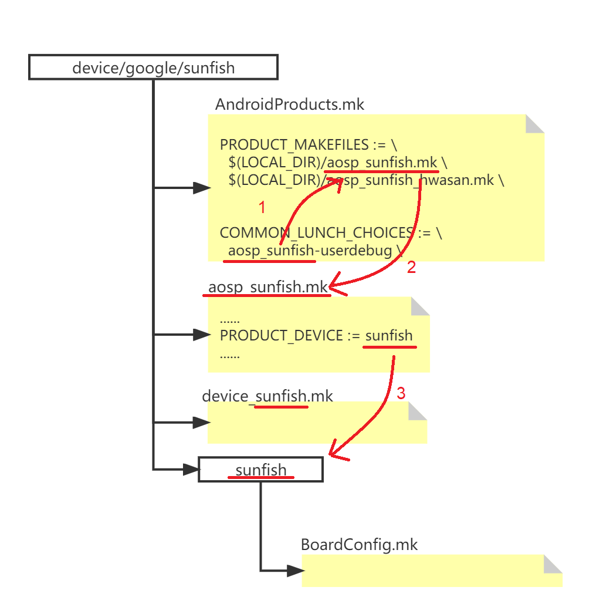
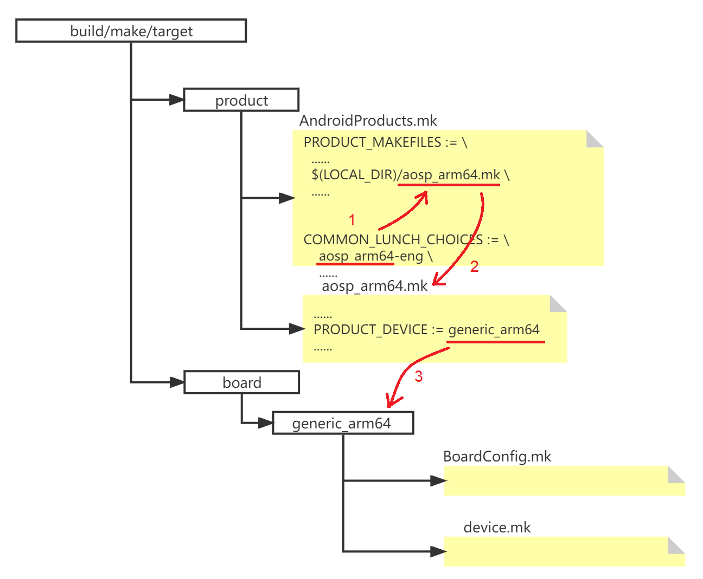

文章标题：**如何为 AOSP 的 lunch 新增一个菜单项**

- 作者：汪辰
- 联系方式：<unicorn_wang@outlook.com> / <wangchen20@iscas.ac.cn>

文章大纲

<!-- TOC -->

- [如何增加一个普通的产品定义](#如何增加一个普通的产品定义)
- [如何增加一个 GSI 的产品定义](#如何增加一个-gsi-的产品定义)

<!-- /TOC -->

注：本文内容基于 AOSP 12 (tag: android-12.0.0_r3)

# 如何增加一个普通的产品定义

本章节是对以下参考文章的内容整理。
- [Adding a New Device](https://source.android.google.cn/setup/develop/new-device)
- [Understanding 64-bit Builds](https://source.android.google.cn/setup/develop/64-bit-builds)


所谓普通的 product，指的是在 AOSP 源码树中 `device` 目录下定义的一些产品

- 第(1)步：创建一个 `device/<company-name>/<device-name>` 目录, 譬如 `device/google/sunfish/`。

- 第(2)步：创建 DEVICE 级别的配置文件（`device.mk`），用来声明设备级别的信息。譬如 `device/google/sunfish/device-sunfish.mk`。sunfish 是一种 board/device 级别的概念，基本上代表了一款硬件，定义了板子上各种外设。我们可以简单看一下 `device-sunfish.mk` 文件的内容：

   ```makefile
   PRODUCT_HARDWARE := sunfish

   include device/google/sunfish/device-common.mk

   ......
   ```

   这个文件又会 include 其他的 mk 文件，譬如 `device-common.mk`, 继续看看
   
   ```makefile
   # define hardware platform
   PRODUCT_PLATFORM := sm7150

   include device/google/sunfish/device.mk

   .....
   ```
   感觉都是对硬件的一些配置和定义

- 第(3)步：创建 PRODUCT 级别的配置文件。PRODUCT 的概念可以理解成是在 DEVICE 更上一层的概念，譬如基于一款 board/device 定义的一款产品，譬如针对不同的国家。地区和运营商的定义。官方文档中的解释是:
  
  > Create a product definition makefile to create a specific product based on the device. 
  
  例如：`device/google/sunfish/aosp_sunfish.mk`。 

  我们查看这个文件发现其内容定义更侧重软件模块，主要是在描述该产品对应的文件系统 image 中会包含哪些模块和软件包等。

  在实际的产品开发中，产品的变化可能会十分丰富，所以有时候我们还会定义一些 base product，定义一些公共的产品特性，然后在这个基础上再定义派生的产品。

  > A common method is to create a base product that contains features that 
  > apply to all products, then create product variants based on that base product. 
  > For example, two products that differ only by their radios (CDMA versus GSM) 
  > can inherit from the same base product that doesn't define a radio.`

  产品的 mk 文件中可以定义的 `PRODUCT_*` 的变量。参考 <https://source.android.google.cn/setup/develop/new-device#prod-def>。 特别注意一个系统预定义的变量 `PRODUCT_DEVICE`
  
  > PRODUCT_DEVICE：Name of the industrial design. This is also the board name, 
  > and the build system uses it to locate BoardConfig.mk.`。

  我们来简单看看 `device/google/sunfish/aosp_sunfish.mk`，注意其中定义的 `PRODUCT_DEVICE := sunfish`
  
  ```makefile
  #
  # All components inherited here go to system image
  #
  $(call inherit-product, $(SRC_TARGET_DIR)/product/core_64_bit.mk)
  $(call inherit-product, $(SRC_TARGET_DIR)/product/generic_system.mk)

  ......

  PRODUCT_MANUFACTURER := Google
  PRODUCT_BRAND := Android
  PRODUCT_NAME := aosp_sunfish
  PRODUCT_DEVICE := sunfish
  PRODUCT_MODEL := AOSP on sunfish
  ```

- 第(4) 步：创建一个板级配置文件 BoardConfig.mk 例如：`device/google/sunfish/sunfish/BoardConfig.mk`，这个文件中定义了更多 board 级别的编译构建变量定义。

  ```makefile
  ......
  include device/google/sunfish/BoardConfig-common.mk
  ```

  感兴趣的可以去看看 `BoardConfig-common.mk` 这个文件。

- 第 (5) 步：上面这些准备工作做好后，我们需要在运行 lunch 命令时在下拉菜单列表中出现和我们的产品项对应的 entry item。具体防范就是创建一个 AndroidProducts.mk 文件。譬如 `device/google/sunfish/AndroidProducts.mk`。这是个入口文件，定义了我们在 lunch 的菜单列表中显示的项目名称以及前面第（3）步定义的 product 文件的位置。

  我们可以看看这个 `device/google/sunfish/AndroidProducts.mk` 文件：
  ```
  PRODUCT_MAKEFILES := \
    $(LOCAL_DIR)/aosp_sunfish.mk \
    $(LOCAL_DIR)/aosp_sunfish_hwasan.mk \

  COMMON_LUNCH_CHOICES := \
    aosp_sunfish-userdebug \
  ```

  `COMMON_LUNCH_CHOICES` 中的字符串项会出现在 lunch 命令的项目列表中。
  
基于以上文件，AOSP 就可以根据我们在 lunch 过程中选择的 product-variant 找到 product 的相关配置文件。步骤大致如下：
- step 1：假设我们选择了 `aosp_sunfish-userdebug` 这一项，则 build 系统会根据 `-` 分离出前半部分的 `aosp_sunfish`。
- step 2：然后再到 `PRODUCT_MAKEFILES` 中去匹配，找到对应的 product 的 mk 文件，也就是我们在第（3）步中创建的 `device/google/sunfish/aosp_sunfish.mk`。
- step 3：找到 `device/google/sunfish/aosp_sunfish.mk` 后，在根据该文件中定义的 `PRODUCT_DEVICE` 的值就可以继续定位到 sunfish 目录，以及该目录下 product 对应的 board 级配置文件，譬如 `device-sunfish.mk` 和 `BoardConfig.mk`。

形象如下图所示，帮助理解整个过程。



# 如何增加一个 GSI 的产品定义

device 目录下的那些产品对应的是具体的一个厂家的设备，Google 还提供了一些官方的 Generic System Images，有关 GSI 可以参考 [Generic System Images](https://source.android.google.cn/setup/build/gsi)。

这些 product 和具体的硬件没有关系，不包含 vendor 相关的内容，只含有 aosp 官方源码下的软件。

这些 GSI product 的定义和我们定义一个普通设备 product 的过程是一致的，以 arm64 为例，和我们前面举例的产品 sunfish 对应关系简单总结如下：

|                 | 普通产品定义                                   | GSI 产品定义                                          |
|-----------------|-----------------------------------------------|------------------------------------------------------|
|Product entry    | `device/google/sunfish/AndroidProducts.mk`    |`build/make/target/product/AndroidProducts.mk`        |
|PRODUCT Config   | `device/google/sunfish/aosp_sunfish.mk`       |`build/make/target/product/aosp_arm64.mk`             |
|Board/BSP config | `device/google/sunfish/sunfish/BoardConfig.mk`|`build/make/target/board/generic_arm64/BoardConfig.mk`|
|DEVICE Config    | `device/google/sunfish/device-sunfish.mk`     |`build/make/target/board/generic_arm64/device.mk`     |

注意不像普通产品，针对每款产品，譬如 sunfish，我们会在 device 的厂家（google）下新建一个独立的产品目录（sunfish）。所有的 GSI 产品的配置文件统一放在 `build/make/target` 下的 product 和 board 子目录下。

参考和对比以上关系，我们可以尝试为 riscv64 增加一款 GSI 产品

- 首先修改入口 `build/make/target/product/AndroidProducts.mk`，在 `COMMON_LUNCH_CHOICES` 中增加一项 `aosp_riscv64-eng`，这意味着 `TARGET_PRODUCT` 是 `aosp_riscv64`，`TARGET_PRODUCT_VARIANT` 是 `eng`。

- 然后增加一个对应的 product 的 mk 文件 `aosp_riscv64.mk`，放在 `build/make/target/product/` 下。同时将该文件的全路径添加到 `build/make/target/product/AndroidProducts.mk` 文件中的 `PRODUCT_MAKEFILES` 变量中。注意这个文件的名字要和 `TARGET_PRODUCT` 的一样。这样 aosp 的构建系统就会找到它了。

  aosp_riscv64.mk 的内容可以参考 aosp_arm64.mk，其中关键要知名如下内容：
  ```
  PRODUCT_NAME := aosp_riscv64
  PRODUCT_DEVICE := generic_riscv64
  PRODUCT_BRAND := Android
  PRODUCT_MODEL := AOSP on RISCV64
  ```

- 注意 `PRODUCT_DEVICE` 的值用于对应找到该产品对应的 BOARD 配置内容，为此我们还要在 `build/make/target/board` 下新建一个同名的 `generic_riscv64` 的目录，基本上一个 ARCH 就占一个目录，从 `generic_arm64` 下复制一份并改名。这个目录下一般需要这么几个文件：

  - README
  - device.mk : board 级别的 mk 文件
  - system.prop
  - BoardConfig.mk：这个 BoardConfig.mk 比较重要，这个文件中定义了更多 board 级别的编译构建变量定义。譬如：
    ```
    TARGET_ARCH := riscv64
    TARGET_ARCH_VARIANT := riscv64
    TARGET_CPU_VARIANT := generic
    TARGET_CPU_ABI := riscv64
    ```

主要就是以上修改，此时运行 lunch 应该就会看到 `aosp_riscv64-eng` 这一项，选择这一项后如果成功会打印出以下 product 配置信息。
```bash
============================================
PLATFORM_VERSION_CODENAME=REL
PLATFORM_VERSION=10
TARGET_PRODUCT=aosp_riscv64
TARGET_BUILD_VARIANT=eng
TARGET_BUILD_TYPE=release
TARGET_ARCH=riscv64
TARGET_ARCH_VARIANT=armv8-a
TARGET_CPU_VARIANT=generic
TARGET_2ND_ARCH=arm
TARGET_2ND_ARCH_VARIANT=armv8-a
TARGET_2ND_CPU_VARIANT=generic
HOST_ARCH=x86_64
HOST_2ND_ARCH=x86
HOST_OS=linux
HOST_OS_EXTRA=Linux-4.15.0-108-generic-x86_64-Ubuntu-18.04.4-LTS
HOST_CROSS_OS=windows
HOST_CROSS_ARCH=x86
HOST_CROSS_2ND_ARCH=x86_64
HOST_BUILD_TYPE=release
BUILD_ID=QQ3A.200605.002.A1
OUT_DIR=out
============================================
```

和普通的产品类似，基于以上文件，AOSP 就可以根据我们在 lunch 过程中选择的 product-variant 找到 product 的相关配置文件。步骤大致如下图所示，大家可以自行描述：



