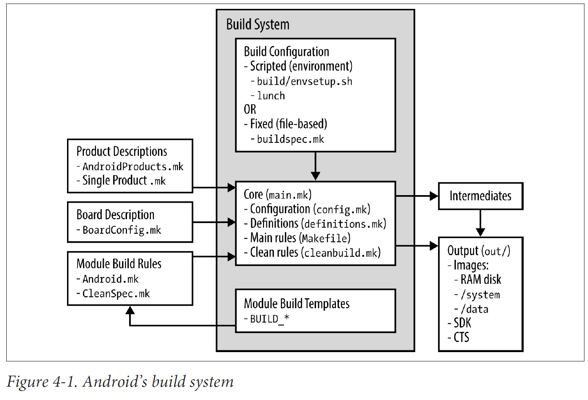

文章标题：**Andorid Build System 研究心得**

- 作者：汪辰
- 联系方式：<unicorn_wang@outlook.com> / <wangchen20@iscas.ac.cn>

Android 的 Build System 一直是特别让人头痛的存在。我以前看的时候主要特别关注 Soong 的部分，但现在发现对整体的处理其实理解得还不够，这里的笔记就是希望从 Build Sytem 的整体角度有个更深刻的理解。

文章大纲

<!-- TOC -->

- [1. 参考](#1-参考)
- [2. 没有引入 Soong 之前的 Android Build System](#2-没有引入-soong-之前的-android-build-system)
	- [2.1. Android Build System 的特点](#21-android-build-system-的特点)
	- [2.2. Android Build System 的框架设计](#22-android-build-system-的框架设计)
- [3. 引入 Soong 后的变化](#3-引入-soong-后的变化)

<!-- /TOC -->

# 1. 参考

- 【参考 1】 Embedded Android, Karim Yagbmour, 2013

# 2. 没有引入 Soong 之前的 Android Build System

我觉得 【参考 1】写得挺好的，虽然这本书成书比较老了，还是基于 Android 2.3 和 4.1 写的，但是还是值得学习，特别是对于我这种在 Android 上半路出家的人，了解一下历史，才能更好地理解现在。

## 2.1. Android Build System 的特点

早期的 Android Build System 基于 make/Makefile 搭建，比较单纯，还是很好理解的。和目前这种半吊子的混合结构相比，难怪 Google 自己都看不下去，要用 Basel 代替，具体参考另一篇笔记 [《Bazel 和 AOSP 介绍》][1]

【参考 1】告诉我们 Android 的 Build System 有这么几个特点。首先值得重点了解的一点是：**Android 构建系统不依赖于递归 makefiles，当我们执行 make 的时候会将所有的 `.mk` 文件都 include 到一个单个 Makefile 文件中**。因此，我们在 AOSP 源码树下看到的每个 `.mk` 文件最终都会成为单个巨大文件的一部分，而这个最终的大文件包含了用于构建的所有的各种变量定义和规则定义。但在实践中，这些文件是被拆分成很多文件，以模块化的方式分别开发的，粘合在一起的方式主要就是采用的 make 的 include 语法。只是这些文件的 include 的顺序有点讲究，后 include 的文件中的变量会依赖于先 include 的文件中的变量。

基于以上框架，对于一个 AOSP 系统（等同于 Ubuntu 发布包）中的众多软件包，在 AOSP 中称之为模块（module），由于不会像普通 GNU 软件的 Build System 那样采用递归方式进行构建，所以并不会为这些 module 提供自己的 Makefile 文件，而是替换为各自 module 的 `Android.mk` 文件。在我们执行 make 时利用会主动扫描 AOSP 源码树，获取所有的 `Android.mk` 文件后在逐个 include 进来。具体可以参考 【参考 1】 中 Chapter 4 中 “Why Does make Hang?” 部分的介绍。引入 Soong 后，无非就是用 `Android.bp` 替换了 `Android.mk`，只不过二吊子的 Soong 只替换了部分 `Android.mk`，所以我们在目前的 AOSP 源码树中 `Android.bp` 和 `Android.mk` 都有。

Android Build System 的另一个特点是在构建 Makefile 过程中使用了大量的变量，从 lunch 开始我们选择完产品就会打印出很多变量的值，这些变量会被设置到环境变量中，再被 make 使用，AOSP Build System 的 Makefile 同样会定义大量的变量，这些变量受到 lunch 阶段的环境变量的影响，进一步影响后续的规则生成。太多的变量分布在太多的 bash 脚本和 makefile 文件中，由于没有图形化的方式可以统一地访问（譬如 Linux 内核那种 menuconfig），所以对初次接触 Android 构建的用户很不友好。更要命的是开发人员定制产品过程中，譬如编写 `Android.mk` 乃至深层次改写 makfile 过程中都需要碰到这些变量，再加上这些变量也没有统一的文档进行描述，对开发人员很不友好，目前看 Soong 里写 `Android.bp` 的体验也好不到哪里去。

## 2.2. Android Build System 的框架设计

下图引用自 【参考 1】 Chapter 4 The Build System 的 “Figure 4-1. Android’s build system”



【图 1】 早期基于 make 的 Android Build System

Build System 作为一个框架，【图 1】 中的灰色底框部分，这个框架由 AOSP 源码树中 `platform/build` 仓库实现。可以认为它为使用者提供了如下的功能：

注，我这里描述的内容一方面参考了 【参考 1】，一方面也结合 AOSP 12 (tag: android_12.0.0_r3) 的实际代码做了些调整，但从我的理解来看，`platform/build` 仓库的代码虽然 12 和 2.3/4/4 不具备可比性，但是基于 make 的总体流程并无本质变化，即使 12 是引入了 Soong 的。

- 快速选择产品，Build System 提供了两种方法：一种是交互方式的 Build Configuration，通过运行 lunch 将我们客制化的 product 信息列举出来，我们选择好后，可以快速加载 product 的参数变量。还有一种称之为 Fixed（基于文件方式），就是将我们确定的 product 配置信息写入 `buildspec.mk`，如果这个文件提供了配置信息，就不用 lunch，make 时直接读取该文件中的内容执行构建。我们常用的方式是 lunch，因为这种方式需要用户至少两次和 bash 交互，所以 lunch 后获取的配置信息会以环境变量方式保存起来，供 make 时读取。

- 执行构建，这是 Build System 的主体，也是当我们输入 make 时执行的动作。入口是 `core/main.mk`, 这个 makefile 文件会依次 **导入** 如下内容（注意这里 **导入** 的概念，回忆前面说的 Android Build System 的第一个特点）。由于篇幅有限，这里仅列出重要的步骤，不重要的内容太多，就不一一列举了。
  
  - 第一步，打印 `[1/1] initializing build system ...` 说明构建开始了。
  
  - 第二步，导入 `core/config.mk`，即导入产品的配置。
  
    导入之前已经通过选择产品获取了 product 的基本信息，配置的过程即基于这些 product 的基本参数值，对其进行检查和过滤，并生成最终的 make 内部的 build 变量。这些 product 的基本信息包括如下，可以看一下 `build/buildspec.mk.default` 这个模板了解一下。

    **值得一提的是，导入 config.mk 过程中还会导入其他一些 `.mk` 文件** 其中最主要的是 `core/envsetup.mk` 而在这个文件中又会导入 `core/product_config.mk` 和 `core/board_config.mk`，并在此过程中导入由用户自己客制化的产品和设备配置信息。
    
  - 第三步，导入辅助函数，主要是对应 【图 1】 中的 `core/definitions.mk`，一些通用的函数需要在 Makefile 中提前定义，后面就都可以使用了。
  
  - 第四步，**导入系统的模块定义文件**。即导入 module 的 `Android.mk` 文件。AOSP 源码树下每个 module 都需要一个唯一的 `Android.mk` 来描述这个 module 如何构建，如何安装等。 这个 【图 1】中没有列出，由于 AOSP 源码树中的 module 很多，而且 AOSP 会将所有 module 定义文件一次性全部读入（`Android.bp` 也是一样），所以执行这个过程比较费时。运行 make 时会看到提示 `Inclduing xxx.mk`。

  - 第五步，解决导入的模块之间的依赖，此时会看到打印 `finishing build rules ...`
  
  - 第六步，导入主要的构建规则，这个指的是 `core/Makefile`，要了解系统的各种 partition/image 是如何构建出来的，可以仔细读一下这个文件。
  
  - 第七步，定义了大量的伪规则，这些伪规则实际上是第六步种构建规则的一个 shortname，譬如我们在 bash 里运行 `make ramdisk`。那么实际 ramdisk 这个 phony rule 的内容实际定义在 `core/Makefile` 中。

  - 第八步，打印 `writing build rules ...` 表示 `core/main.mk` 执行完毕。

在 【图 1】 Build System 的最下面还有一些 Module Build Templates，这些实际对应了一些 Android 为我们提前写好的用于构建诸如可执行程序，共享库的规则的模板，省去了我们自己编写也避免出错。

可以参考 `core/config.mk`：
```makefile
# ###############################################################
# Build system internal files
# ###############################################################

BUILD_COMBOS :=$= $(BUILD_SYSTEM)/combo

CLEAR_VARS :=$= $(BUILD_SYSTEM)/clear_vars.mk

BUILD_HOST_STATIC_LIBRARY :=$= $(BUILD_SYSTEM)/host_static_library.mk
BUILD_HOST_SHARED_LIBRARY :=$= $(BUILD_SYSTEM)/host_shared_library.mk
BUILD_STATIC_LIBRARY :=$= $(BUILD_SYSTEM)/static_library.mk
BUILD_HEADER_LIBRARY :=$= $(BUILD_SYSTEM)/header_library.mk
BUILD_SHARED_LIBRARY :=$= $(BUILD_SYSTEM)/shared_library.mk
BUILD_EXECUTABLE :=$= $(BUILD_SYSTEM)/executable.mk
BUILD_HOST_EXECUTABLE :=$= $(BUILD_SYSTEM)/host_executable.mk
BUILD_PACKAGE :=$= $(BUILD_SYSTEM)/package.mk
BUILD_PHONY_PACKAGE :=$= $(BUILD_SYSTEM)/phony_package.mk
BUILD_RRO_PACKAGE :=$= $(BUILD_SYSTEM)/build_rro_package.mk
BUILD_HOST_PREBUILT :=$= $(BUILD_SYSTEM)/host_prebuilt.mk
BUILD_PREBUILT :=$= $(BUILD_SYSTEM)/prebuilt.mk
BUILD_MULTI_PREBUILT :=$= $(BUILD_SYSTEM)/multi_prebuilt.mk
BUILD_JAVA_LIBRARY :=$= $(BUILD_SYSTEM)/java_library.mk
BUILD_STATIC_JAVA_LIBRARY :=$= $(BUILD_SYSTEM)/static_java_library.mk
BUILD_HOST_JAVA_LIBRARY :=$= $(BUILD_SYSTEM)/host_java_library.mk
BUILD_COPY_HEADERS :=$= $(BUILD_SYSTEM)/copy_headers.mk
BUILD_NATIVE_TEST :=$= $(BUILD_SYSTEM)/native_test.mk
BUILD_FUZZ_TEST :=$= $(BUILD_SYSTEM)/fuzz_test.mk

BUILD_NOTICE_FILE :=$= $(BUILD_SYSTEM)/notice_files.mk
BUILD_HOST_DALVIK_JAVA_LIBRARY :=$= $(BUILD_SYSTEM)/host_dalvik_java_library.mk
BUILD_HOST_DALVIK_STATIC_JAVA_LIBRARY :=$= $(BUILD_SYSTEM)/host_dalvik_static_java_library.mk
```

在我们编写 module 的 `Android.mk` 时可以用这些 `BUILD_*` 的变量名直接导入这些规则定义文件。make 就会根据规则的类型按照指定的方式进行构建。

【图 1】 的左边是在告诉我们，基于 Android 的 Build System 这个框架，我们需要提供哪些客制化的内容：

- 产品级别的内容，也就是 【图 1】 中的 Product Description 和 Board Description 部分的内容，通过对产品进行定义，主要是通过客制化一些变量告诉我们的 Build System 一款 product 自身的参数和构建的选项参数。这部分内容可以参考笔记 [《如何为 AOSP 的 lunch 新增一个菜单项》][2]，现在我们知道这些内容会在上述执行构建的第二步中被导入。

- 模块级别的构建规则，即 【图 1】 中的 Module Build Rules。大部分 AOSP 的 platform 中的 module 系统已经为我们写好了 `Android.mk`，但是如果我们需要客制化或者新增一些 module，也需要做相应的工作。这些 module 的定义文件会在上述执行构建的第四步被导入。

【图 1】 的左边是在告诉我们 Android Build System 的输出是在源码树下的一个独立的 out 目录，所以 AOSP 的构建不会污染源码部分。干净的清理只要 `rm -rf out` 即可。

# 3. 引入 Soong 后的变化

仅仅是按照我自己的理解总结一下，仅供参考。以 AOSP 12 (tag: android-12.0.0_r3) 为参考代码基线。

我目前理解一个完整的构建和原来的差异不大，因为引入 Soong 后，只是把部分 module 的 `Android.mk` 替换为了 `Android.bp`。系统 image 的制作部分还是基于 Makefile 的，当然和最最初的区别是不是直接将 Makefile 传入 make 执行，而是交给 Kati 转化成 ninja 文件，building action 的最终动作是由 ninja 来驱动完成的。

所以还是结合 【图 1】 来看 AOSP 引入 Soong 后的变化：

- Product Descriotions 和 Board Description 部分没有什么变化

- Module Build Rules 这块，将 module 的 `Android.mk` 改写成 `Android.bp`

- Build System 部分，这部分改动较大，引入了 `soong_ui` 和 `soong_build` 等新的程序，并围绕这些程序封装了一个新的构建过程。

  - 在选择产品阶段，执行 lunch 过程中会调用 `soong_ui` （具体是触发 dumpVars，导致 `core/config.mk` 被调用，并在导入 `core/soong_config.mk` 并执行后会产生一个 `out/soong/soong.variables` 文件。这个文件将 make 过程中产生的一些变量以 json 格式记录在 `soong.variables` 这个文件中供后面 `soong_build` 使用。

  - 在构建阶段，可以参考 [《代码走读：对 soong_ui 的深入理解》][3] 中 “build.Build 函数分析” 部分，其核心执行顺序如下（不完整，抽取了核心步骤）：
  
    - 首先执行 runSoong：这是 Soong 新引入的步骤，这个过程中调用 `soong_build` 扫描所有的 `Android.bp` 转化为 ninjia 文件。为了和原有的 build system 融合，需要将执行 `soong_build` 构建中产生的一些信息传递给 Kati/make。传递信息的方式依然是文件，有两个文件我们需要重点关注一下。
    
      一个是 `$SOONG_MAKEVARS_MK`, 实例为：`out/soong/make_vars-sdk_phone64_riscv64.mk`, 这个文件是执行 `soong_build` 后产生的文件，里面定义的都是形如 `SOONG_*` 的变量。这些变量的含义就是将 soong 定义的一些常量值以 make 变量的形式输出出来形成一个 mk 文件给 kati 用的。具体 `soong_build` 中是如何生成该文件，可以看 ModuleMakeVarsProvider 的 `GenerateBuildActions()` 这个函数，代码在 `build/soong/android/makevars.go`。
    
      另一个是 `$(SOONG_ANDROID_MK)` 文件，譬如：`out/soong/Android-sdk_phone64_riscv64.mk`。这是一个很大的文件，打开看一下会发现这是一个符合 Android.mk 格式的形式的文件，但不是只针对一个 module，而是包含了所有解析过的 bp 文件中针对所有的 module 的符合 `Android.mk` 的定义，可以认为是那些采用 `Android.bp` 文件的 module 所对应的多个 `Android.mk` 文件的一个集合。这个文件将会被后续的步骤所使用。
  
      摘录部分内容如下：
  
      ```
      LOCAL_MODULE_MAKEFILE := $(lastword $(MAKEFILE_LIST))
      
      include $(CLEAR_VARS)
      LOCAL_PATH := system/sepolicy
      LOCAL_MODULE := 26.0.compat.cil
      LOCAL_LICENSE_KINDS := SPDX-license-identifier-Apache-2.0   legacy_unencumbered
      LOCAL_LICENSE_CONDITIONS := notice unencumbered
      LOCAL_NOTICE_FILE := system/sepolicy/NOTICE
      LOCAL_LICENSE_PACKAGE_NAME := system_sepolicy_license
      LOCAL_MODULE_CLASS := ETC
      LOCAL_PREBUILT_MODULE_FILE := out/soong/.intermediates/system/sepolicy/  26.0.compat.cil/android_common/gen/26.0.compat.cil
      LOCAL_FULL_INIT_RC := 
      LOCAL_MODULE_PATH := out/target/product/emulator_riscv64/system/etc/  selinux/mapping
      LOCAL_INSTALLED_MODULE_STEM := 26.0.compat.cil
      include $(BUILD_PREBUILT)
      
      include $(CLEAR_VARS)
      LOCAL_PATH := system/sepolicy
      LOCAL_MODULE := 26.0.ignore.cil
      LOCAL_LICENSE_KINDS := SPDX-license-identifier-Apache-2.0   legacy_unencumbered
      LOCAL_LICENSE_CONDITIONS := notice unencumbered
      LOCAL_NOTICE_FILE := system/sepolicy/NOTICE
      LOCAL_LICENSE_PACKAGE_NAME := system_sepolicy_license
      LOCAL_MODULE_CLASS := ETC
      LOCAL_PREBUILT_MODULE_FILE := out/soong/.intermediates/system/sepolicy/  26.0.ignore.cil/android_common/gen/26.0.ignore.cil
      LOCAL_FULL_INIT_RC := 
      LOCAL_MODULE_PATH := out/target/product/emulator_riscv64/system/etc/  selinux/mapping
      include $(BUILD_PREBUILT)
      ......
      ```
 
    - 其次执行 runKatiBuild，这个函数封装了 Kati 处理，传入的是原来 make 的入口 `core/main.mk`，仍然是原来执行构建的处理过程，但针对加入 Soong 后做了一些改动。
  
      - 在第二步和第三步之间加了一步，导入 `$(SOONG_MAKEVARS_MK)`。

      - 在第四部导入系统模块定义的过程中除了导入那些还没有转化为采用 `Android.bp` 的 module 所对应的 `Android.mk` 外，还会导入`$(SOONG_ANDROID_MK)` 文件，见上一步 runSoong 中的骚操作。所以说这里导入 module 时依然是一个全集，只是部分已经迁移到 soong 了，所以采用 `$(SOONG_ANDROID_MK)` 文件过渡了一下。
    
    - 执行完 runKatiBuild 后执行 createCombinedBuildNinjaFile：合并 soong 和 kati 各自产生的 ninja 文件
  
    - 最后执行 runNinjaForBuild，也就是执行 ninja，读入上一步生成的 ninja build 描述文件驱动构建实际的动作。

目前大致的理解如上，写得比较粗糙，可能还有一些细节，后面再慢慢补充。


[1]: ./20220615-introduce-bazel-for-aosp.md
[2]: ./20220315-howto-add-lunch-entry.md
[3]: ./20211102-codeanalysis-soong_ui.md

